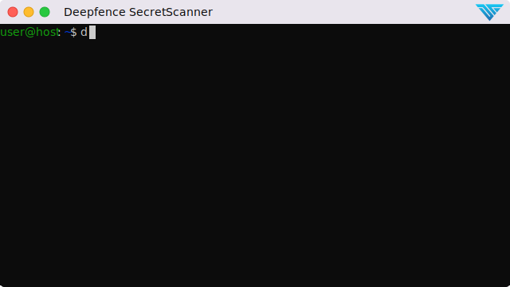

# SecretScanner

[](https://community.deepfence.io/docs/secretscanner/)
[](https://github.com/deepfence/SecretScanner/blob/master/LICENSE)
[](https://github.com/deepfence/SecretScanner/stargazers)
[](https://github.com/deepfence/SecretScanner/issues)
[](https://github.com/deepfence/SecretScanner/issues)
[](https://join.slack.com/t/deepfence-community/shared_invite/zt-podmzle9-5X~qYx8wMaLt9bGWwkSdgQ)
[](https://twitter.com/intent/tweet?text=Check%20this%20out%3A&url=https%3A%2F%2Fgithub.com%2Fdeepfence%2FSecretScanner)

# SecretScanner

Deepfence SecretScanner can find unprotected secrets in container images or file systems.

* SecretScanner is a standalone tool that retrieves and searches container and host filesystems, matching the contents against a database of approximately 140 secret types.
* SecretScanner is also included in [ThreatMapper](https://github.com/deepfence/ThreatMapper), an open source scanner that identifies vulnerable dependencies and unprotected secrets in cloud native applications, and ranks these vulnerabilities based on their risk-of-exploit ([example](https://github.com/deepfence/ThreatMapper/wiki/Scanning-Production-Deployments))

## What are Secrets?

Secrets are any kind of sensitive or private data which gives authorized users permission to access critical IT infrastructure (such as accounts, devices, network, cloud based services), applications, storage, databases and other kinds of critical data for an organization. For example, passwords, AWS access IDs, AWS secret access keys, Google OAuth Key etc. are secrets. Secrets should be strictly kept private. However, sometimes attackers can easily access secrets due to flawed security policies or inadvertent mistakes by developers. Sometimes developers use default secrets or leave hard-coded secrets such as passwords, API keys, encryption keys, SSH keys, tokens etc. in container images, especially during rapid development and deployment cycles in CI/CD pipeline. Also, sometimes users store passwords in plain text. Leakage of secrets to unauthorized entities can put your organization and infrastructure at serious security risk.

Deepfence SecretScanner helps users scan their container images or local directories on hosts and outputs a JSON file with details of all the secrets found.

Check out our [blog](https://medium.com/deepfence-cloud-native-security/detecting-secrets-to-reduce-attack-surface-3405ee6329b5) for more details.

## When to use SecretScanner

Use SecretScanner if you need a lightweight, efficient method to scan container images and filesystems for possible secrets (keys, tokens, passwords). You can then review these possible 'secrets' to determine if any of them should be removed from production deployments.

## Quick Start

For full instructions, refer to the [SecretScanner Documentation](https://community.deepfence.io/docs/secretscanner/).



Install docker and run SecretScanner on a container image using the following instructions:

* Build SecretScanner:
```shell
./bootstrap.sh
docker build --rm=true --tag=quay.io/deepfenceio/deepfence_secret_scanner_ce:2.3.0 -f Dockerfile .
```

* Or, pull the latest build from docker hub by doing:
```shell
docker pull quay.io/deepfenceio/deepfence_secret_scanner_ce:2.3.0
```

* Pull a container image for scanning:
```shell
docker pull node:8.11
```

* Scan the container image:
    ```shell
    docker run -i --rm --name=deepfence-secretscanner -v /var/run/docker.sock:/var/run/docker.sock quay.io/deepfenceio/deepfence_secret_scanner_ce:2.3.0 -image-name node:8.11 --output json > node.json
    ```

# Credits

We have built upon the configuration file from [shhgit](https://github.com/eth0izzle/shhgit) project.

## Get in touch

Thank you for using SecretScanner.

 * [](https://community.deepfence.io/docs/secretscanner/) Start with the documentation
 * [](https://join.slack.com/t/deepfence-community/shared_invite/zt-podmzle9-5X~qYx8wMaLt9bGWwkSdgQ) Got a question, need some help?  Find the Deepfence team on Slack
 * [](https://github.com/deepfence/SecretScanner/issues) Got a feature request or found a bug? Raise an issue
 * [productsecurity *at* deepfence *dot* io](SECURITY.md): Found a security issue? Share it in confidence
 * Find out more at [deepfence.io](https://deepfence.io/)

## Security and Support

For any security-related issues in the SecretScanner project, contact [productsecurity *at* deepfence *dot* io](SECURITY.md).

Please file GitHub issues as needed, and join the Deepfence Community [Slack channel](https://join.slack.com/t/deepfence-community/shared_invite/zt-podmzle9-5X~qYx8wMaLt9bGWwkSdgQ).


# Disclaimer

This tool is not meant to be used for hacking. Please use it only for legitimate purposes like detecting secrets on the infrastructure you own, not on others' infrastructure. DEEPFENCE shall not be liable for loss of profit, loss of business, other financial loss, or any other loss or damage which may be caused, directly or indirectly, by the inadequacy of SecretScanner for any purpose or use thereof or by any defect or deficiency therein.
